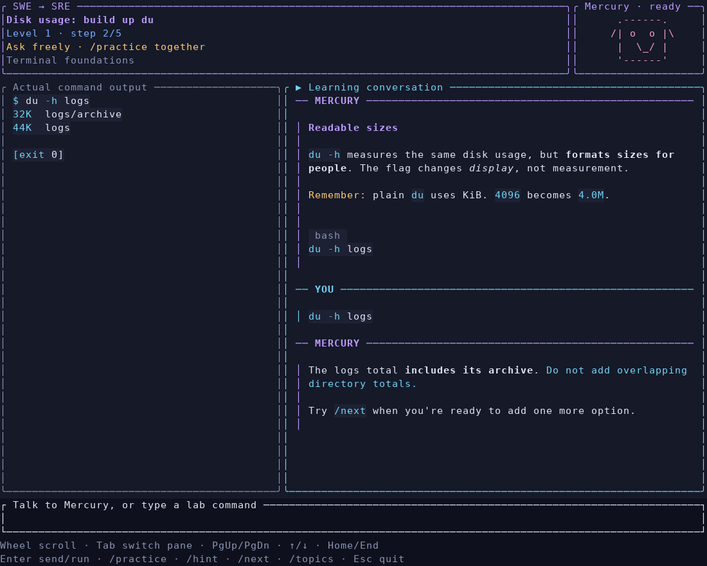

# SRE Trainer

A conversational SRE teacher for an experienced software engineer learning operations. The default flow is **explain → worked example → guided practice → later reinforcement**. It assumes the SRE material is new to you.



## Run locally

```bash
git clone https://github.com/Kadajett/Tui-sre-study.git
cd Tui-sre-study
cp .env.example .env
# Put your OpenRouter key and reference URLs in .env.
docker compose build
docker compose run --rm trainer
```

The key stays in `.env`, which Git and Docker exclude. The example file contains no key. Docker Compose supplies the private environment at runtime.

## Start on Nucbox

```bash
tailscale ssh kadajett@nucbox
cd ~/Tui-sre-study
docker compose run --rm trainer
```

If an older trainer is already open, exit it and launch again to use the updated image. Existing progress and the private `.env` remain on Nucbox.

Brand-new learning profiles choose a random **unlearned beginner command** from the easiest unfinished level. Restarts restore the same conversation and topic, including completed topics. `/next` chooses another eligible topic after the current course is complete. There are 40 topics in four levels:

| Level | Focus |
| --- | --- |
| 1 | Terminal foundations: `du`, `grep`, `jq`, `chmod`, `ps`, `ip` |
| 2 | Networks, containers, and Kubernetes basics |
| 3 | Operating a service: observability, SLOs, incidents, delivery |
| 4 | Reliability and system design: retries, capacity, recovery, infrastructure |

`/levels` shows progress; `/level N` explores a level. Each command builds up one addition at a time. Every required step must be practiced before that topic joins the shared reinforcement pool. You can choose a topic directly with `/topic ID`; `/topic linux-du-1` starts or resumes `du`.

A different starting collection works the same way:

```bash
docker compose run --rm trainer --deck kubernetes
docker compose run --rm trainer --deck networking
docker compose run --rm trainer --deck sre
```

## Talk and practice

Type ordinary messages such as `I don't understand that`, `Can you show me a smaller example?`, or an explanation in your own words. You don't need an `/ask` prefix. Supported lab commands execute when typed; command output is displayed separately from the conversation.

- **Enter** sends your message or runs a supported lab command.
- `/practice` invites a small exercise with the teacher.
- `/hint` asks for a simpler explanation.
- `/next` moves on after practice demonstrates the current concept; otherwise it asks the teacher to guide you through a small example first.
- `/topics` lists the topics in your selected collection.
- `/topic ID` chooses a topic, for example `/topic sre-slos`. A collection name also selects its first topic.
- **Mouse wheel** scrolls the pane under the pointer. Clicking a pane selects it.
- **Tab / Shift+Tab** chooses the conversation or command output pane for keyboard scrolling.
- **PageUp / PageDown** scrolls that pane by a page; **Up / Down** moves one line.
- **Home / End** jumps to the beginning or latest content. New replies preserve your position while you read earlier messages; End resumes following new replies.
- `/levels` lists the four learning levels; `/level N` chooses one.
- **Esc**, **Ctrl+C**, or `/quit` exits.

The Ratatui interface uses violet, blue, cyan, pink and amber, with an animated teacher bot and visible scrollbars. Speaker dividers and word-wrapped paragraphs separate messages. Markdown supports **bold**, *italic*, ~~strikethrough~~, headings, lists, underlined links and highlighted code. The teacher can emphasize phrases with `<violet>`, `<blue>`, `<cyan>`, `<amber>`, `<pink>`, `<red>` and `<u>` tags. Unsupported HTML is text, not executed markup. Italics depend on the terminal and font; the app does not change browser fonts or sizes.

Commands in the input, conversation and output panes receive syntax highlighting. Fenced blocks use their language label (including shell, JSON, YAML and Python); inline code uses shell highlighting. Unrecognized labels fall back to shell syntax. Raw command output retains its whitespace. Holding Shift typically lets your terminal select/copy text while mouse capture is active.

Mercury works in the background. Up to eight messages can wait while it answers. A topic switch discards queued messages and ignores an in-flight reply from the old topic. Every submitted message, the full scrollable conversation, current topic/step, command output, draft input and reading position persist in SQLite. A turn waiting for Mercury is saved before its request starts. On restart it retries the model response with the saved command evidence; it never reruns the command. Topic changes append to the same conversation. Restarting does not add an introduction or repeat a completed addition. A terminal of at least 55 columns by 18 rows is required.

## How reinforcement works

Spaced repetition supplies private context to the teacher on each turn: up to three due **previously learned** topics, the latest answer, assessment and teaching notes. It does not open a separate review screen. The teacher can connect a due idea to what you're discussing, offer a small recall opportunity, explain it again if needed, and continue the lesson.

A topic enters repetition only after demonstrated practice. For concepts, Mercury assesses a substantive explanation after offering practice. For command labs, the app verifies actual execution. Introductions, assent such as `okay`, `/next`, and requests for help do not establish mastery. Completing introductory learning schedules the first reinforcement for a day later and does not record a quiz attempt.

The teacher can update a due review only after it has invited that specific review and received an answer. Successful reinforcement increases the interval; needing help schedules another opportunity in ten minutes. Reviewing an older concept cannot graduate the current new topic. Assessment is model-based for conversational answers and can be imperfect; there are no self-grading buttons or keyword grading in the default conversation.

Reinforcement sessions last **24 elapsed hours from their start**. Returning or sending a new message starts a new session once that window has elapsed, when you are in reinforcement or have learned topics due for it. Midnight, scrolling, typing a draft, and background replies do not start another session. Session boundaries only provide context for post-learning reinforcement; they never reset teaching, erase the conversation, or choose a new topic.

The learning position, full dialogue, queued turns, practice status and teaching notes are stored in the existing SQLite progress volume. All previously saved teacher messages are imported on the first upgraded launch. Older messages or pending requests that earlier versions never saved cannot be recovered. Unfinished course additions carry forward. Earlier completed courses remain learned. Old quiz attempts are preserved as history but don't prove that an unfamiliar topic was taught. An already completed guided `du` course is recognized as learned.

## Curriculum and reference access

The 40 topics cover Linux investigation, networking, Kubernetes, cloud compute/storage, SLIs/SLOs and error budgets, observability, incident response, canaries and schema changes, retries/backpressure/idempotency, capacity, backups and recovery.

Six beginner courses run actual commands (`du`, `grep`, `jq`, `chmod`, `ps`, `ip`). The `ip` course only permits read-only address/route inspection inside the container. `kubectl` has five introductory steps covering contexts, namespace-scoped pod lists, wide output, describe/events and logs. Its commands open **clearly labeled sample output**, with no cluster connection; the teacher checks your explanation before advancing each step. Other Kubernetes and cloud topics are conversational. `du` has a persistent practice tree for comparing additions within a session. Other labs generate disposable fixtures per command.

Opening explanations use the prepared lesson material. During conversation, Mercury can discover document collections, search indexes, read pages from your DevDocs, and search via your SearXNG. Retrieved sources are shown in its answer. Catalog entries are verified through index/page access; missing pages or failed searches are reported.

Configuration comes from the private, ignored `.env`:

```dotenv
OPENROUTER_API_KEY=your-key
OPENROUTER_MODEL=inception/mercury-2.5
DEVDOCS_URL=https://devdocs.tailf93a13.ts.net
SEARXNG_URL=https://searxng.tailf93a13.ts.net
```

The configured key is excluded from the image and lab subprocesses. Your messages, command output, recent conversation and due-topic notes are sent to OpenRouter. Selected search queries go through SearXNG, and retrieved excerpts may be sent to the teacher. Reference tools don't receive the API key or execute shell commands.

Without Mercury, introductory material remains visible and the command labs still work. Conversational assessment waits for a successful teacher response; connection failures never imply that a topic was learned.

## Container and development

Compose runs an unprivileged user with dropped capabilities, a read-only root and temporary `/tmp`. The `du` runner accepts a bounded set of flags and known fixture paths, clears its environment, never invokes a shell, and has a four-second timeout. The new beginner courses additionally restrict execution to their prepared command variants. Legacy Linux runners retain their executable allowlists and should be used inside the container. Do not mount host paths or cloud credentials into it.

Progress is in the existing `sre-progress` volume. Avoid `docker compose down -v` unless you intend to delete it. A pre-upgrade source archive and image tag are retained on Nucbox.

```bash
cargo fmt --check
cargo clippy --all-targets --all-features -- -D warnings
cargo test --locked
docker compose build
docker compose run --rm -T trainer --stats
```

The Docker build runs the tests and uses `Cargo.lock`. Workstation builds are transferred to Nucbox to avoid leaving compiler caches on its nearly full disk.

Optional live diagnostics (teacher/coach checks make a billable OpenRouter request):

```bash
docker compose run --rm -T trainer --check-teacher sre-slos
docker compose run --rm -T trainer --check-coach
docker compose run --rm -T trainer --lookup read_doc '{"doc":"bash","path":"exit-status"}'
```

The old card interface remains available only through explicit `--cards`; `--du-drill` retains the previous deterministic drill. Neither is the default teaching flow.
